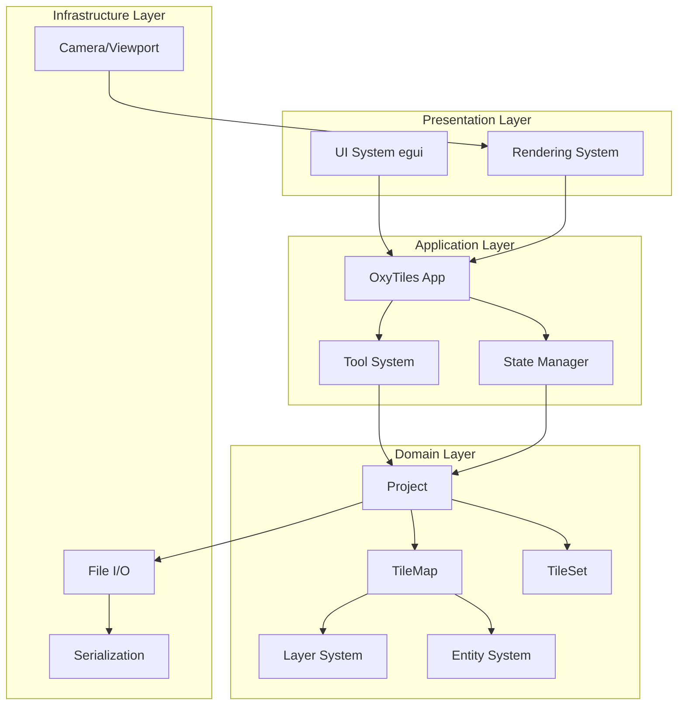
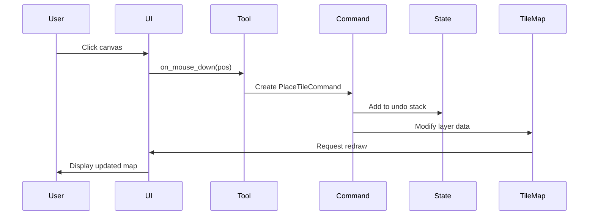
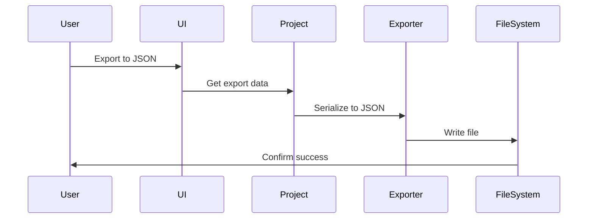

# OxyTiles - Tile/Level Editor Design Document

**Version:** 0.1.0  
**Last Updated:** February 2026  
**Status:** Design Phase

---

## Table of Contents

1. [Project Overview & Goals](#1-project-overview--goals)
2. [Core Features & Requirements](#2-core-features--requirements)
3. [Architecture Design](#3-architecture-design)
4. [UI/UX Design](#4-uiux-design)
5. [Technical Decisions](#5-technical-decisions)
6. [File Format Specification](#6-file-format-specification)
7. [Development Roadmap](#7-development-roadmap)

---

## 1. Project Overview & Goals

### 1.1 What is OxyTiles?

OxyTiles is a modern tile/level editor built with Rust and egui, designed to address critical limitations in existing tools like Tiled and LDTK. It focuses on providing a clean, flexible JSON export format that integrates seamlessly with any game engine while maintaining a powerful native editing experience.

### 1.2 Problems Being Solved

**Inflexible File Formats**
- Existing tools often use proprietary or overly complex formats
- Difficult to parse without using specific libraries
- Limited control over export structure and data organization
- Hard to version control effectively

**Difficult Game Engine Integration**
- Tight coupling to specific engine formats
- Requires custom parsers or converters
- Data structures don't match common game engine patterns
- Unnecessary metadata bloats the export files

**Limited Scripting/Automation** *(Future Enhancement)*
- Manual repetitive tasks that could be automated
- No easy way to extend functionality
- Batch processing limitations

### 1.3 Core Design Philosophy

1. **Clean Data First**: Export format should be clean, minimal JSON that's trivial to parse
2. **Engine Agnostic**: Work with any game engine, from Bevy to Unity to custom engines
3. **Human-Readable**: All files should be readable and editable in a text editor
4. **Version Control Friendly**: File formats designed for git-friendly diffs
5. **Performance Focused**: Handle large maps efficiently with proper rendering optimizations
6. **Extensible Architecture**: Built to support future automation and plugin systems

---

## 2. Core Features & Requirements

### 2.1 MVP (Minimum Viable Product)

**Must-Have Features for v1.0:**

- **Tileset Management**
  - Load sprite sheets (PNG, JPG)
  - Define tile dimensions
  - Visual tile picker/palette
  - Multiple tilesets per project
  - Tile properties (collision, custom metadata)

- **Tilemap Editing**
  - Multi-layer support (background, terrain, foreground, etc.)
  - Draw, erase, fill tools
  - Rectangular selection and copy/paste
  - Grid display with configurable size
  - Pan and zoom camera controls
  - Undo/redo system

- **Layer System**
  - Create, delete, rename layers
  - Show/hide layers
  - Lock layers to prevent editing
  - Layer opacity control
  - Reorder layers

- **File Operations**
  - New project creation
  - Save/load project files (internal format)
  - Export to JSON (clean, engine-ready format)
  - Auto-save functionality

- **Basic UI**
  - Tileset panel
  - Layer panel
  - Tools panel
  - Canvas/viewport
  - Properties panel
  - Menu bar (File, Edit, View)

### 2.2 Future Enhancements (Post-MVP)

**Phase 2 Features:**
- Entity/object layer support
- Custom tile animations
- Tile variations and rotations
- Auto-tiling rules (terrains)
- Multiple map support (world editor)

**Phase 3 Features:**
- Lua/Rhai scripting API
- Plugin system
- CLI for batch operations
- Procedural generation helpers
- Custom exporters

**Phase 4 Features:**
- Collaborative editing
- Cloud project storage
- Asset browser/manager
- Prefab/template system

---

## 3. Architecture Design

### 3.1 High-Level System Architecture



### 3.2 Core Components

#### 3.2.1 Project
**Responsibility:** Root container for all editor data

```rust
struct Project {
    name: String,
    tile_maps: Vec<TileMap>,
    tile_sets: Vec<TileSet>,
    settings: ProjectSettings,
    metadata: HashMap<String, Value>,
}

struct ProjectSettings {
    default_tile_size: (u32, u32),
    background_color: Color,
    grid_color: Color,
    export_settings: ExportSettings,
}
```

#### 3.2.2 TileSet
**Responsibility:** Manage sprite sheet and tile definitions

```rust
struct TileSet {
    id: Uuid,
    name: String,
    texture: Option<TextureHandle>,
    texture_path: PathBuf,
    tile_size: (u32, u32),
    spacing: u32,
    margin: u32,
    tiles: Vec<Tile>,
}

struct Tile {
    id: u32,
    source_rect: Rect,
    properties: HashMap<String, TileProperty>,
    collision: Option<CollisionData>,
}

enum TileProperty {
    Bool(bool),
    Int(i64),
    Float(f64),
    String(String),
    Color(Color),
}
```

#### 3.2.3 TileMap
**Responsibility:** Manage the actual map data with multiple layers

```rust
struct TileMap {
    id: Uuid,
    name: String,
    width: u32,
    height: u32,
    tile_size: (u32, u32),
    layers: Vec<Layer>,
    entities: Vec<Entity>,
}

struct Layer {
    id: Uuid,
    name: String,
    layer_type: LayerType,
    visible: bool,
    locked: bool,
    opacity: f32,
    offset: (i32, i32),
    data: LayerData,
}

enum LayerType {
    Tile,
    Entity,
    Image,
}

struct LayerData {
    tiles: Vec<Vec<Option<TileInstance>>>, // 2D grid
}

struct TileInstance {
    tileset_id: Uuid,
    tile_id: u32,
    flip_x: bool,
    flip_y: bool,
    rotation: Rotation,
}

enum Rotation {
    None,
    Clockwise90,
    Clockwise180,
    Clockwise270,
}
```

#### 3.2.4 Camera
**Responsibility:** Handle viewport transformations and navigation

```rust
struct Camera {
    position: Vec2,
    zoom: f32,
    viewport_size: Vec2,
}

impl Camera {
    fn screen_to_world(&self, screen_pos: Pos2) -> Pos2;
    fn world_to_screen(&self, world_pos: Pos2) -> Pos2;
    fn pan(&mut self, delta: Vec2);
    fn zoom_at(&mut self, point: Pos2, delta: f32);
}
```

#### 3.2.5 Tool System
**Responsibility:** Handle user interactions and editing operations

```rust
trait Tool {
    fn on_mouse_down(&mut self, pos: Pos2, state: &mut EditorState);
    fn on_mouse_move(&mut self, pos: Pos2, state: &mut EditorState);
    fn on_mouse_up(&mut self, pos: Pos2, state: &mut EditorState);
    fn get_cursor(&self) -> CursorIcon;
}

struct PencilTool;
struct EraseTool;
struct FillTool;
struct SelectTool;
struct PanTool;
```

#### 3.2.6 State Manager
**Responsibility:** Undo/redo and state persistence

```rust
struct StateManager {
    undo_stack: Vec<EditorCommand>,
    redo_stack: Vec<EditorCommand>,
    max_undo_levels: usize,
}

trait EditorCommand {
    fn execute(&mut self, state: &mut EditorState);
    fn undo(&mut self, state: &mut EditorState);
}
```

### 3.3 Data Flow

**Editing Flow:**


**Export Flow:**


---

## 4. UI/UX Design

### 4.1 Main Interface Layout

```
┌─────────────────────────────────────────────────────────────────┐
│ File  Edit  View  Layer  Tools  Help                            │
├─────────┬───────────────────────────────────────────┬───────────┤
│         │                                           │           │
│ Tileset │                                           │  Layers   │
│ Panel   │                                           │  Panel    │
│         │                                           │           │
│ ┌─────┐ │           Canvas/Viewport                 │ □ Layer 3 │
│ │█ █ █│ │                                           │ □ Layer 2 │
│ │█ █ █│ │        (Main editing area)                │ ☑ Layer 1 │
│ │█ █ █│ │                                           │           │
│ └─────┘ │                                           ├───────────┤
│         │                                           │           │
│         │                                           │Properties │
│ Tools   │                                           │  Panel    │
│ Panel   │                                           │           │
│         │                                           │ Size: 32  │
│ ✏️ 🧽    │                                           │ Type: Bg  │
│ 🪣 ✂️    │                                           │           │
├─────────┴───────────────────────────────────────────┴───────────┤
│ Status: Ready | Zoom: 100% | Position: (0, 0) | Layer: Layer 1 │
└─────────────────────────────────────────────────────────────────┘
```

### 4.2 Panel Descriptions

**Tileset Panel** (Left side, collapsible)
- Dropdown to select active tileset
- Grid view of all tiles in selected tileset
- Search/filter tiles
- Tile properties editor
- Add/remove tileset buttons

**Canvas/Viewport** (Center, main area)
- Scrollable/pannable workspace
- Zoom controls (mouse wheel, buttons)
- Grid overlay (toggleable)
- Ruler/guides
- Multi-layer preview with opacity

**Layers Panel** (Right side, top)
- List of layers with visibility toggles
- Add/delete/duplicate layer buttons
- Drag to reorder
- Lock icon for each layer
- Opacity slider per layer

**Properties Panel** (Right side, bottom)
- Context-sensitive properties
- Selected tile properties
- Layer properties
- Map properties
- Entity properties (future)

**Tools Panel** (Left side, below tileset)
- Tool buttons (pencil, eraser, fill, select, etc.)
- Tool-specific options
- Keyboard shortcuts displayed

### 4.3 Key User Workflows

**Creating a New Map:**
1. File → New Project
2. Set map dimensions and tile size
3. Add tileset(s)
4. Create layers as needed
5. Start editing

**Placing Tiles:**
1. Select tileset from tileset panel
2. Click tile to select it
3. Choose tool (pencil is default)
4. Click or drag on canvas to place tiles
5. Switch layers to work on different depths

**Editing Layers:**
1. Click layer in Layers panel to select
2. Toggle visibility to focus on specific layers
3. Lock layers to prevent accidental edits
4. Adjust opacity to see through layers
5. Reorder by dragging in layer list

**Exporting:**
1. File → Export → JSON
2. Choose export location
3. Optionally configure export settings
4. Confirm export
5. Use exported JSON in game engine

### 4.4 UX Improvements Over Existing Tools

**vs. Tiled:**
- Cleaner, more modern UI with better contrast
- Faster tileset navigation with search
- More intuitive layer management
- Better keyboard shortcut system
- Real-time JSON preview option

**vs. LDTK:**
- Simpler, less overwhelming interface for basic tasks
- More straightforward export format
- Better tile property system
- More responsive viewport rendering
- Clearer visual feedback

**General Improvements:**
- Consistent egui-based interface
- Native performance (no Electron)
- Smaller memory footprint
- Faster startup time
- Better multi-monitor support

---

## 5. Technical Decisions

### 5.1 Rendering Approach

**Choice: Immediate Mode Rendering with egui**

**Rationale:**
- egui provides immediate mode GUI paradigm
- Natural fit for editor tools with dynamic content
- Built-in widgets for panels, buttons, etc.
- Good performance for medium-sized maps

**Implementation Strategy:**
1. **Canvas Rendering:**
   - Use `egui::Painter` for custom drawing
   - Render tiles as textured rectangles
   - Layer-based rendering with proper depth sorting
   - Viewport culling to only render visible tiles

2. **Optimization Techniques:**
   - Chunk-based rendering for large maps
   - Texture atlasing for tilesets
   - Cached mesh generation for static content
   - Only redraw when state changes

3. **Grid and Overlay:**
   - Render grid lines using `Painter::line_segment`
   - Selection overlay with transparency
   - Hover highlight for active cell

### 5.2 State Management

**Choice: Command Pattern with Undo/Redo Stack**

**Rationale:**
- Clean separation of actions and state
- Natural undo/redo implementation
- Easy to test and debug
- Supports action composition

**Implementation:**
```rust
struct EditorState {
    project: Project,
    active_tool: Box<dyn Tool>,
    selected_tile: Option<(Uuid, u32)>, // (tileset_id, tile_id)
    active_layer: Option<Uuid>,
    camera: Camera,
    state_manager: StateManager,
}
```

**State Persistence:**
- Auto-save every 5 minutes (configurable)
- Save project state to internal format (RON or MessagePack)
- Keep separate from export format
- Recovery from crashes

### 5.3 File I/O and Serialization

**Internal Project Format:**
- **Choice:** RON (Rusty Object Notation) or MessagePack
- **Rationale:** 
  - RON: Human-readable, good for debugging
  - MessagePack: Binary, smaller files, faster parsing
  - Both support serde seamlessly

**Export Format:**
- **Choice:** Clean JSON with minimal structure
- **Rationale:**
  - Universal compatibility
  - Easy to parse in any language
  - Human-readable for debugging
  - Git-friendly

**Serialization Strategy:**
```rust
// Using serde for both formats
use serde::{Serialize, Deserialize};

#[derive(Serialize, Deserialize)]
struct ProjectFile {
    version: String,
    project: Project,
}

// Separate export structure optimized for games
#[derive(Serialize)]
struct MapExport {
    name: String,
    width: u32,
    height: u32,
    tile_width: u32,
    tile_height: u32,
    layers: Vec<LayerExport>,
    tilesets: Vec<TilesetReference>,
}
```

### 5.4 Performance Considerations

**Target Performance Metrics:**
- Render 60 FPS with maps up to 1000x1000 tiles
- Smooth panning and zooming
- Instant tool response (<16ms)
- Fast project loading (<2s for typical projects)

**Optimization Strategies:**

1. **Viewport Culling:**
   ```rust
   fn get_visible_tiles(&self, camera: &Camera) -> impl Iterator<Item = (i32, i32)> {
       let viewport = camera.get_viewport_bounds();
       let start_x = (viewport.min.x / self.tile_width as f32).floor() as i32;
       let end_x = (viewport.max.x / self.tile_width as f32).ceil() as i32;
       // ... return only visible tile coordinates
   }
   ```

2. **Chunk-Based Storage:**
   - Divide large maps into chunks (32x32 tiles)
   - Only load/render active chunks
   - Sparse chunk storage for empty regions

3. **Texture Management:**
   - Load textures on-demand
   - Cache loaded textures
   - Unload unused textures
   - Support for texture atlases

4. **Dirty Rectangle Tracking:**
   - Only redraw changed regions
   - Mark layers as dirty when modified
   - Full redraw only when necessary

### 5.5 Dependencies

**Current Dependencies:**
- `eframe` - Application framework
- `egui` - Immediate mode GUI
- `egui_extras` - Image loading support
- `image` - Image decoding
- `rfd` - Native file dialogs

**Additional Dependencies Needed:**
- `serde` - Serialization framework
- `serde_json` - JSON export
- `ron` - Internal project format (or `rmp-serde` for MessagePack)
- `uuid` - Unique identifiers
- `directories` - Cross-platform paths
- `log` + `env_logger` - Logging
- `anyhow` - Error handling

**Optional Future Dependencies:**
- `rhai` or `mlua` - Scripting support
- `rayon` - Parallel processing for large operations
- `notify` - File system watching
- `zip` - Compressed project files

---

## 6. File Format Specification

### 6.1 Internal Project Format (.oxytiles)

**Format:** RON (Rusty Object Notation)

**Example:**
```ron
ProjectFile(
    version: "0.1.0",
    project: Project(
        name: "My Game Level",
        tile_maps: [
            TileMap(
                id: "550e8400-e29b-41d4-a716-446655440000",
                name: "Level 1",
                width: 64,
                height: 32,
                tile_size: (16, 16),
                layers: [
                    Layer(
                        id: "650e8400-e29b-41d4-a716-446655440001",
                        name: "Background",
                        visible: true,
                        locked: false,
                        opacity: 1.0,
                        // ... layer data
                    ),
                ],
            ),
        ],
        tile_sets: [
            TileSet(
                id: "750e8400-e29b-41d4-a716-446655440002",
                name: "Terrain",
                texture_path: "assets/terrain.png",
                tile_size: (16, 16),
                // ... tileset data
            ),
        ],
    ),
)
```

### 6.2 Export JSON Format

**Design Goals:**
- Minimal, only what's needed for runtime
- No editor-specific metadata
- Flat structure where possible
- Easy to parse without complex logic

**Example Export:**
```json
{
  "version": "1.0",
  "name": "Level 1",
  "width": 64,
  "height": 32,
  "tileWidth": 16,
  "tileHeight": 16,
  "tilesets": [
    {
      "id": "terrain",
      "name": "Terrain",
      "imagePath": "terrain.png",
      "tileWidth": 16,
      "tileHeight": 16,
      "tileCount": 256,
      "columns": 16
    }
  ],
  "layers": [
    {
      "name": "Background",
      "type": "tile",
      "visible": true,
      "opacity": 1.0,
      "offsetX": 0,
      "offsetY": 0,
      "data": [
        0, 0, 1, 2, 3, 0, 0, ...
      ]
    },
    {
      "name": "Terrain",
      "type": "tile",
      "visible": true,
      "opacity": 1.0,
      "offsetX": 0,
      "offsetY": 0,
      "data": [
        -1, -1, 10, 11, 12, -1, -1, ...
      ]
    }
  ]
}
```

**Data Encoding:**
- Tile IDs are integers (0-based index into tileset)
- `-1` or `null` represents empty tile
- Data array is row-major order (left-to-right, top-to-bottom)
- Optional compression with gzip for large maps

**Alternative Format: Separate Data Files**
```json
// level.json
{
  "version": "1.0",
  "name": "Level 1",
  "width": 64,
  "height": 32,
  "tileWidth": 16,
  "tileHeight": 16,
  "tilesets": ["tilesets/terrain.json"],
  "layers": ["layers/background.json", "layers/terrain.json"]
}

// tilesets/terrain.json
{
  "id": "terrain",
  "name": "Terrain",
  "imagePath": "../assets/terrain.png",
  // ... tileset data
}

// layers/background.json
{
  "name": "Background",
  "type": "tile",
  "dataFile": "background.bin"  // Or inline data array
}
```

### 6.3 Format Versioning

**Version Strategy:**
- Semantic versioning (MAJOR.MINOR.PATCH)
- MAJOR: Breaking changes to format
- MINOR: New fields (backward compatible)
- PATCH: Bug fixes, no format changes

**Backward Compatibility:**
- Always read older versions
- Upgrade on save (with user confirmation)
- Export format more stable than project format

---

## 7. Development Roadmap

### 7.1 Phase 1: Foundation (MVP Core)

**Goal:** Basic working editor with essential features

**Tasks:**
1. **Project Structure Setup**
   - Finalize data structures for Project, TileMap, TileSet, Layer
   - Implement serialization/deserialization
   - Set up error handling framework

2. **Basic UI Framework**
   - Layout main window with panels
   - Implement panel system (collapsible, resizable)
   - Create menu bar with basic File/Edit/View menus

3. **Tileset Management**
   - Load tileset images
   - Display tileset in grid
   - Tile selection functionality
   - Basic tile properties

4. **Camera System**
   - Pan with middle mouse or spacebar
   - Zoom with mouse wheel
   - Screen-to-world coordinate conversion
   - Viewport bounds calculation

5. **Basic Rendering**
   - Render single layer tilemap
   - Grid overlay
   - Tile placement preview
   - Selection highlight

6. **Core Tools**
   - Pencil tool (place single tiles)
   - Eraser tool
   - Pan tool
   - Basic tool switching

7. **Layer System**
   - Create/delete layers
   - Layer visibility toggle
   - Layer selection
   - Basic layer rendering

8. **File Operations**
   - New project
   - Save project (internal format)
   - Load project
   - Basic export to JSON

**Deliverable:** Working editor that can create simple single-layer maps and export to JSON

### 7.2 Phase 2: Essential Features

**Goal:** Production-ready editor with full layer support

**Tasks:**
1. **Advanced Layer Features**
   - Layer opacity
   - Layer locking
   - Layer reordering (drag-and-drop)
   - Multiple layer rendering

2. **Advanced Tools**
   - Fill/bucket tool
   - Rectangular selection
   - Copy/paste
   - Line tool
   - Rectangle tool

3. **Undo/Redo System**
   - Command pattern implementation
   - Undo stack management
   - Redo functionality
   - Memory management for large operations

4. **Multi-Tileset Support**
   - Load multiple tilesets
   - Switch between tilesets
   - Tileset management UI
   - Per-layer tileset assignment

5. **Advanced Rendering**
   - Viewport culling optimization
   - Tile flipping (horizontal/vertical)
   - Tile rotation
   - Performance profiling and optimization

6. **UI Polish**
   - Keyboard shortcuts
   - Context menus
   - Status bar with useful info
   - Tool options panel
   - Properties inspector

7. **File Format Refinement**
   - Optimized JSON export
   - Export settings/options
   - Multiple export targets
   - Auto-save functionality

**Deliverable:** Full-featured editor suitable for real game development

### 7.3 Phase 3: Advanced Features

**Goal:** Professional-grade features and workflow improvements

**Tasks:**
1. **Tile Properties System**
   - Custom property definitions
   - Property editor UI
   - Property export in JSON
   - Property templates

2. **Auto-Tiling**
   - Terrain brush definitions
   - Auto-tile rule system
   - Preview and application
   - Common terrain patterns library

3. **Entity/Object Layer**
   - Point entities
   - Area entities
   - Entity properties
   - Entity templates

4. **Advanced Export Options**
   - CSV export
   - Binary format export
   - Custom exporter plugins
   - Batch export

5. **Project Management**
   - Recent projects list
   - Project templates
   - Asset browser
   - External file references

**Deliverable:** Feature-complete editor competing with commercial tools

### 7.4 Phase 4: Extensibility & Automation

**Goal:** Scriptable, extensible platform

**Tasks:**
1. **Scripting API**
   - Lua/Rhai integration
   - API for common operations
   - Script editor
   - Script library

2. **Plugin System**
   - Plugin architecture
   - Plugin discovery and loading
   - Plugin marketplace/registry
   - Example plugins

3. **CLI Interface**
   - Headless mode
   - Batch operations
   - CI/CD integration
   - Scripting from command line

4. **Advanced Automation**
   - Procedural generation tools
   - Macro recording
   - Custom tool creation
   - Workflow automation

**Deliverable:** Fully extensible platform for power users

### 7.5 Implementation Priorities

**High Priority (MVP):**
- ✓ Project data structures
- ✓ Basic UI layout
- ✓ Tileset loading and display
- ✓ Camera controls
- ✓ Single-layer editing
- ✓ Pencil and eraser tools
- ✓ Save/load/export

**Medium Priority (Post-MVP):**
- Multi-layer support
- Undo/redo
- Advanced tools (fill, select, copy/paste)
- Tile transformations (flip, rotate)
- Performance optimization

**Low Priority (Future):**
- Auto-tiling
- Entity system
- Scripting
- Plugins
- CLI

### 7.6 Success Metrics

**Technical Metrics:**
- Load time: < 2 seconds for typical projects
- Render performance: 60 FPS for maps up to 1000x1000
- Memory usage: < 500MB for large projects
- File size: Exported JSON < 10% larger than optimal binary

**User Experience Metrics:**
- Time to create first map: < 5 minutes for new users
- Learning curve: Basic proficiency in < 30 minutes
- Workflow efficiency: 2x faster than Tiled for common tasks

**Quality Metrics:**
- Zero data loss on crashes (auto-save)
- Exported JSON parses in all major game engines
- No blocking UI operations > 100ms

---

## Implementation Notes

### Current Codebase Assessment

**Existing Files:**
- [`src/main.rs`](src/main.rs:1): Basic egui app scaffold
- [`src/camera.rs`](src/camera.rs:1): Empty Camera struct placeholder
- [`src/canvas.rs`](src/canvas.rs:1): Commented-out Canvas implementation
- [`src/tile_map.rs`](src/tile_map.rs:1): Empty TileMap struct placeholder
- [`src/tile_set.rs`](src/tile_set.rs:1): Empty TileSet struct placeholder
- [`src/ui/mod.rs`](src/ui/mod.rs:1): Basic UI setup with test visuals

**Next Steps:**
1. Implement core data structures based on this design
2. Set up proper module organization
3. Implement Camera with pan/zoom functionality
4. Build Canvas rendering system
5. Create tileset loading and display
6. Implement basic tools

### Recommended File Structure

```
oxytiles/
├── src/
│   ├── main.rs              # Entry point
│   ├── app.rs               # Main OxyTiles application state
│   ├── project/
│   │   ├── mod.rs           # Project management
│   │   ├── tileset.rs       # TileSet implementation
│   │   ├── tilemap.rs       # TileMap implementation
│   │   └── layer.rs         # Layer implementation
│   ├── editor/
│   │   ├── mod.rs           # Editor state
│   │   ├── camera.rs        # Camera/viewport
│   │   ├── tools/
│   │   │   ├── mod.rs       # Tool trait and manager
│   │   │   ├── pencil.rs    # Pencil tool
│   │   │   ├── eraser.rs    # Eraser tool
│   │   │   └── fill.rs      # Fill tool
│   │   └── commands/
│   │       ├── mod.rs       # Command pattern
│   │       └── state.rs     # State manager (undo/redo)
│   ├── rendering/
│   │   ├── mod.rs           # Rendering system
│   │   └── canvas.rs        # Canvas rendering
│   ├── io/
│   │   ├── mod.rs           # File I/O
│   │   ├── project.rs       # Project load/save
│   │   └── export.rs        # JSON export
│   └── ui/
│       ├── mod.rs           # UI orchestration
│       ├── panels/
│       │   ├── tileset.rs   # Tileset panel
│       │   ├── layers.rs    # Layers panel
│       │   ├── tools.rs     # Tools panel
│       │   └── properties.rs # Properties panel
│       └── menus.rs         # Menu bar
├── assets/                  # Example assets for testing
├── docs/                    # Documentation
├── examples/                # Example projects
└── tests/                   # Integration tests
```

---

## Conclusion

This design document provides a comprehensive blueprint for building OxyTiles, a modern tile editor that addresses the key limitations of existing tools. The focus on clean JSON export, engine-agnostic design, and extensible architecture positions OxyTiles as a flexible solution for indie game developers.

The phased development approach ensures that the MVP delivers immediate value while building a foundation for advanced features. By prioritizing clean data formats and performance, OxyTiles will integrate seamlessly into modern game development workflows, particularly with Rust-based engines like Bevy.

**Next Steps:**
1. Review and approve this design document
2. Set up detailed task tracking for Phase 1
3. Begin implementation starting with core data structures
4. Iterate based on user feedback during development
