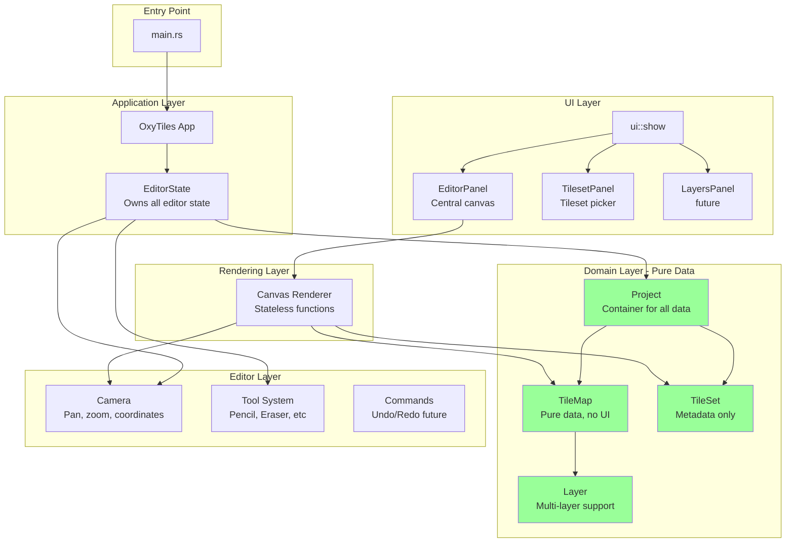
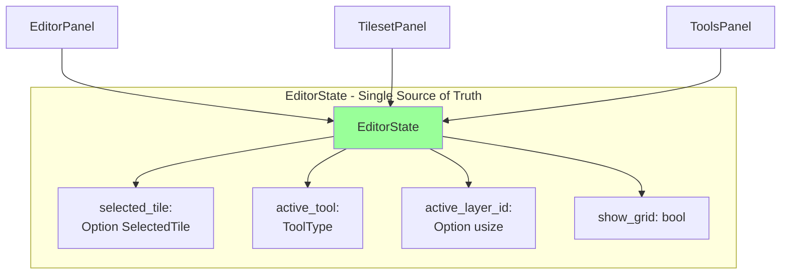
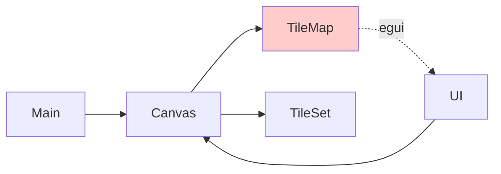
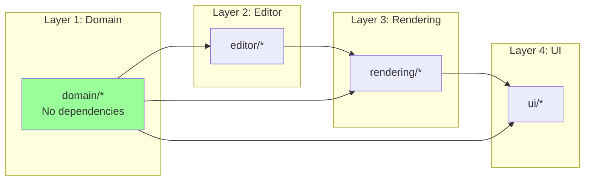
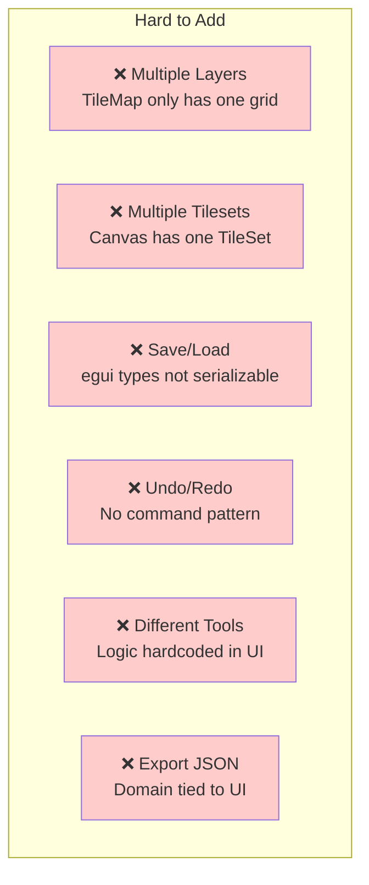
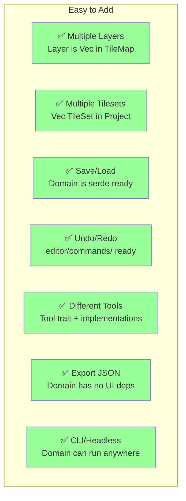
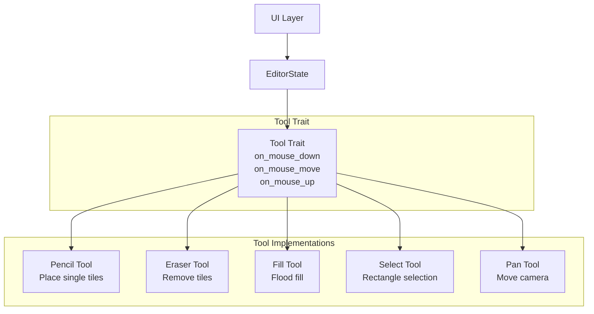
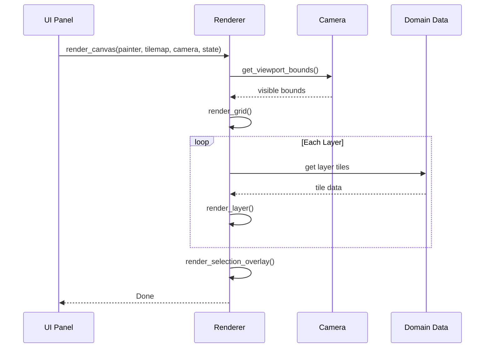
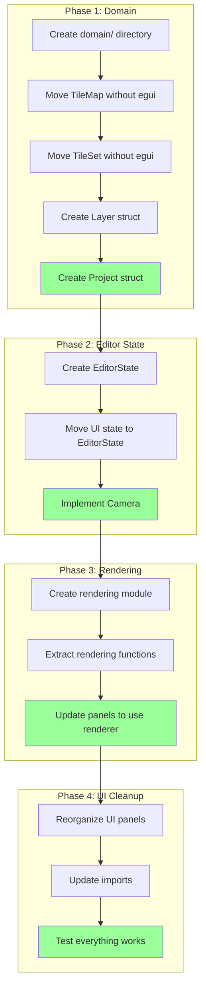

# OxyTiles Architecture Diagrams

## Current Architecture (Your Implementation)

### Data Flow

```mermaid
graph TB
    subgraph "main.rs"
        App[OxyTiles App]
    end
    
    subgraph "Data Layer Mixed"
        Canvas[Canvas<br/>owns everything]
        TileMap[TileMap<br/>+ selected_rect UI state<br/>+ egui::Rect for tiles]
        TileSet[TileSet<br/>+ texture handle]
        Camera[Camera<br/>empty!]
    end
    
    subgraph "UI Layer"
        UIShow[ui::show]
        Editor[editor.rs<br/>renders + handles input]
        SidePanel[side_panel.rs<br/>tileset picker]
    end
    
    App --> Canvas
    Canvas --> TileMap
    Canvas --> TileSet
    Canvas -.x Camera
    
    UIShow --> Editor
    UIShow --> SidePanel
    Editor --> Canvas
    SidePanel --> Canvas
    
    style TileMap fill:#ff9999
    style Canvas fill:#ff9999
    style Camera fill:#ff9999
```

**Problems Highlighted:**
- 🔴 Canvas is a "god object" owning everything
- 🔴 TileMap contains UI state (selected_rect)
- 🔴 TileMap uses egui::Rect for data (framework leakage)
- 🔴 Camera not implemented
- 🔴 UI logic mixed with rendering

---

## Recommended Architecture

### Clean Layered Architecture



**Benefits:**
- ✅ Clear separation of concerns
- ✅ Domain layer has no UI dependencies
- ✅ Easy to test each layer independently
- ✅ Scalable architecture
- ✅ Follows Rust best practices

---

## State Management Comparison

### Current: Scattered State

```mermaid
graph LR
    subgraph "State is Everywhere!"
        A[Canvas.selected_rect<br/>position] 
        B[TileMap.selected_rect<br/>UV coords]
        C[side_panel.rs<br/>local state]
    end
    
    A -.? B
    B -.? C
    
    style A fill:#ffcccc
    style B fill:#ffcccc
    style C fill:#ffcccc
```

**Problem:** Three different places track selection, unclear which is the source of truth!

---

### Recommended: Centralized State



**Benefits:**
- ✅ One place to look for state
- ✅ Easy to serialize for save/load
- ✅ Clear ownership

---

## Module Dependencies

### Current: Circular Dependencies Risk



**Problem:** TileMap depends on egui, creating circular dependency risk

---

### Recommended: Clean Dependency Flow



**Benefits:**
- ✅ One-way dependencies (no cycles)
- ✅ Domain can be reused in CLI, tests, etc.
- ✅ Easy to understand and maintain

---

## Data Model Comparison

### Current: Confusing Data Types

```rust
// What does Rect mean here? UV coords? Screen rect?
pub tiles: HashMap<(usize, usize), egui::Rect>

// UI state mixed with domain data
pub struct TileMap {
    pub size: Vec2,
    pub selected_rect: Option<Rect>,  // ❌
    pub tiles: HashMap<(usize, usize), egui::Rect>,  // ❌
}
```

---

### Recommended: Clear, Self-Documenting Types

```rust
// Clear what everything means
pub tiles: HashMap<(u32, u32), TileInstance>

pub struct TileMap {
    pub name: String,
    pub width: u32,
    pub height: u32,
    pub tile_width: u32,
    pub tile_height: u32,
    pub layers: Vec<Layer>,  // Multi-layer support
}

pub struct Layer {
    pub id: usize,
    pub name: String,
    pub visible: bool,
    pub locked: bool,
    pub opacity: f32,
    pub tiles: HashMap<(u32, u32), TileInstance>,
}

pub struct TileInstance {
    pub tileset_id: usize,  // Which tileset
    pub tile_id: u32,       // Which tile in tileset
    pub flip_x: bool,
    pub flip_y: bool,
}

pub struct SelectedTile {
    pub tileset_id: usize,
    pub tile_id: u32,
}
```

---

## Feature Scalability

### Current Structure Limitations



---

### Recommended Structure: Built for Growth



---

## Tool System Architecture

### Recommended: Extensible Tool System



**Benefits:**
- Easy to add new tools
- Tools are testable independently
- Clean separation from UI code

---

## Rendering Pipeline

### Recommended: Stateless Rendering



**Benefits:**
- Pure functions (easy to test)
- No hidden state
- Rendering optimizations isolated
- Clear data flow

---

## Migration Path Visual



---

## Summary Comparison

| Aspect | Current 🔴 | Recommended ✅ |
|--------|-----------|----------------|
| **Architecture** | Flat, coupled | Layered, decoupled |
| **Data Models** | egui types mixed in | Pure Rust types |
| **State** | Scattered | Centralized in EditorState |
| **Camera** | Not implemented | Full implementation |
| **Tools** | Hardcoded | Trait-based system |
| **Layers** | Single grid only | Multi-layer support |
| **Tilesets** | One at a time | Multiple tilesets |
| **Serialization** | Blocked by egui | Ready with serde |
| **Testing** | Hard (needs egui) | Easy (pure functions) |
| **Extensibility** | Difficult | Easy to extend |

---

## Code Size Comparison

### Current Implementation
```
src/
├── main.rs              (~50 lines)
├── camera.rs            (1 line - empty!)
├── canvas.rs            (~40 lines)
├── tile_map.rs          (~25 lines)
├── tile_set.rs          (~18 lines)
└── ui/
    ├── mod.rs           (~15 lines)
    ├── editor.rs        (~55 lines)
    └── side_panel.rs    (~73 lines)

Total: ~277 lines
```

### After Refactoring (Estimated)
```
src/
├── main.rs              (~30 lines - simpler!)
├── app.rs               (~50 lines)
├── domain/
│   ├── mod.rs           (~20 lines)
│   ├── project.rs       (~50 lines)
│   ├── tile_map.rs      (~80 lines - more features!)
│   ├── tile_set.rs      (~60 lines)
│   └── layer.rs         (~40 lines)
├── editor/
│   ├── mod.rs           (~15 lines)
│   ├── state.rs         (~80 lines)
│   ├── camera.rs        (~100 lines - full impl!)
│   └── tools/
│       ├── mod.rs       (~40 lines)
│       ├── pencil.rs    (~30 lines)
│       └── eraser.rs    (~25 lines)
├── rendering/
│   ├── mod.rs           (~10 lines)
│   └── canvas.rs        (~120 lines)
└── ui/
    ├── mod.rs           (~20 lines)
    └── panels/
        ├── mod.rs       (~15 lines)
        ├── editor_panel.rs   (~60 lines)
        └── tileset_panel.rs  (~70 lines)

Total: ~915 lines
```

**More code, but:**
- ✅ Much more features (layers, camera, tools, etc.)
- ✅ Better organized and easier to understand
- ✅ Easier to maintain long-term
- ✅ Each file has single responsibility
- ✅ Ready for expansion (undo/redo, save/load, etc.)

**Lines per feature comparison:**
- Current: ~277 lines for basic functionality
- Recommended: ~915 lines for complete MVP with:
  - Full camera system
  - Multi-layer support
  - Multiple tilesets
  - Tool system
  - Better data models
  - Serialization ready
  
**That's roughly 3x the code for 10x the features!**
